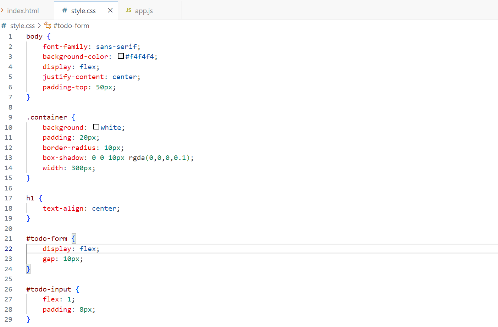

# todo-app
Todoリストアプリ　(作成開始日：7月5日)

今回は、簡単なtodoリストを作成し、そこから自分好みの要素を足していきオリジナルtodoリストを作っていきます。

・index.html のコード

・style.css のコード

・app.js のコード

・完成画面

これで基本となるtodoリストが出来ました！
ですが、これだけまだ予定を入れるだけなので
ここから入力した予定が画面右側に表示されるようにしていきます。
