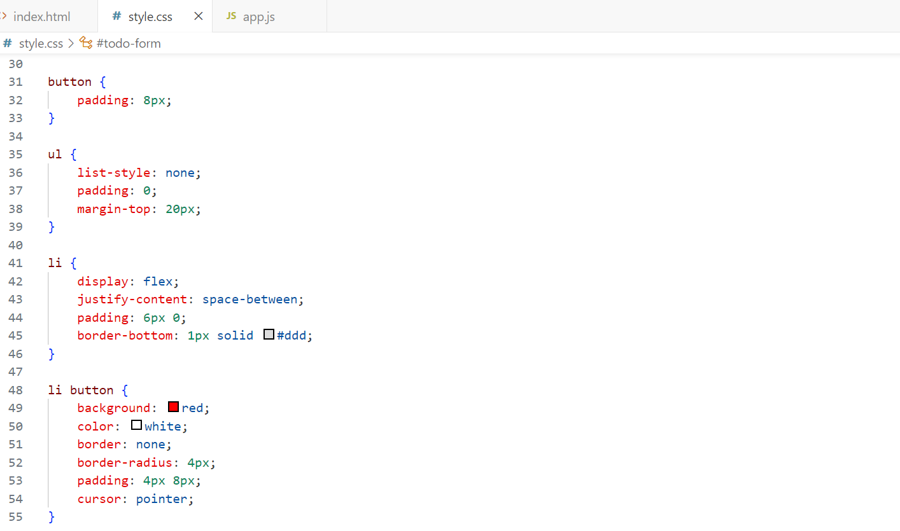

# todo-app
Todoリストアプリ　
～　https://shimabukuroshunichi.github.io/todo-app/　～(作成開始日：7月5日)

今回は、簡単なtodoリストを作成し、そこから自分好みの要素を足していきオリジナルtodoリストを作っていきます。

## ・index.html のコード

## ・style.css のコード

## ・app.js のコード

## ・完成画面

これで基本となるtodoリストが出来ました！
ですが、これだけまだ予定を入れるだけなので  
ここから入力した予定が画面右側に表示されるようにしていきます。

まずはindex.htmlを変更していきます。
クラスをinput-areaとtodo-displayの二つに分けて予定を入れる欄と  
それを表示する欄を作りました。(マーカーの箇所)

次にstyle.cssも変更します。  
始めに作成したstyle.cssはbodyの中にdisplayとjustify-contentが入っていましたが、.containerの中に移動します。  
こうすることで入力欄と表示欄が横並びになり、見やすくなります！

## ・完成画面

左側で今日の予定を入力し、それを右側に表示させることができました！

ですが、このままの状態ではページを更新したり一度削除してしまうと  
せっかく作った予定が消えてしまうのでローカルストレージを使ってそれらを防ぐ機能を実装します。